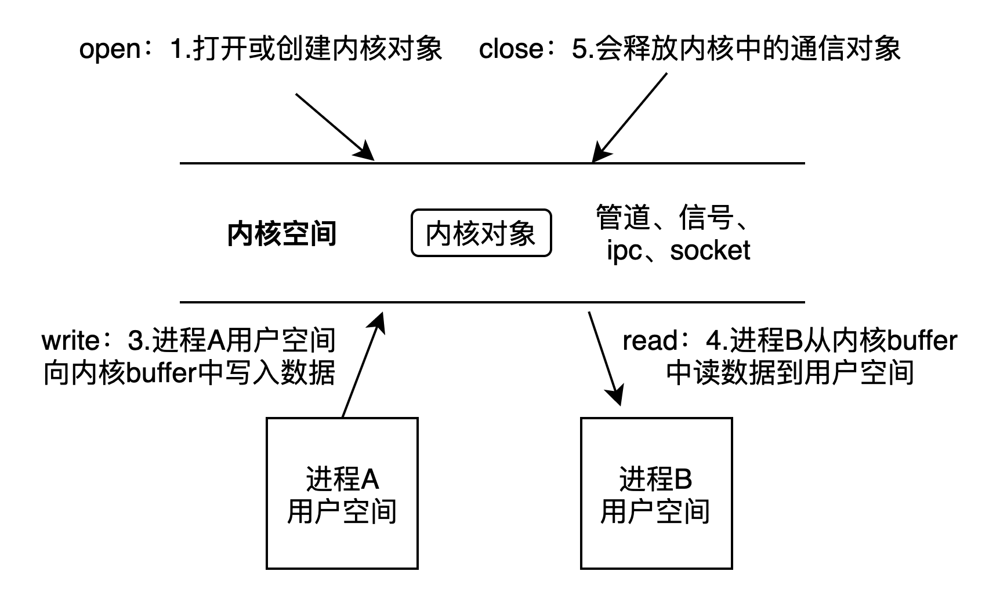

#1 进程通信和线程间通信介绍
##1.1 进程通信和线程通信的区别
```
进程通信：
    在用户空间实现进程通信不可能，通过linux内核通信。
    因为每个进程的用户空间都是独立的，无法在用户空间上通信
线程间通信：
    可以在用户空间中实现，可以通过全局变量通信
```

##1.2 进程通信的方式
* **单机模式下的进程通信**   
  只有一个linux内核。管道、信号、ipc、socket都属于内核对象（用户空间上的对象无法完成进程间通信）
```
管道通信:
    无名管道、有名管道（文件系统中有名）
信号通信：
    信号(通知）通信包括：信号的发送、信号的接收和信号的处理
IPC通信：
    共享内存、消息队列、信号灯
```
* **网络模式下的进程通信**  
  两个linux内核。

##1.3 进程通信的学习思路
每一种通信方式都是**基于文件IO思想。**
```
open:
    创建或打开进程通信对象，函数形式不一样，有的是多个函数完成
write:
    向进程通信对象中写入内容，函数形式可能不一样
read:
    从进程通信对象中读取内容，函数形式可能不一样
close:
    关闭或删除进程间
```
* **文件IO操作**
  
* **内核对象操作**
```
类似文件IO操作，需要先在内核中创建一个对象。
然后进程A向内核中写入数据，进程B向内核中读取数据，从而实现进程间通信。
```
