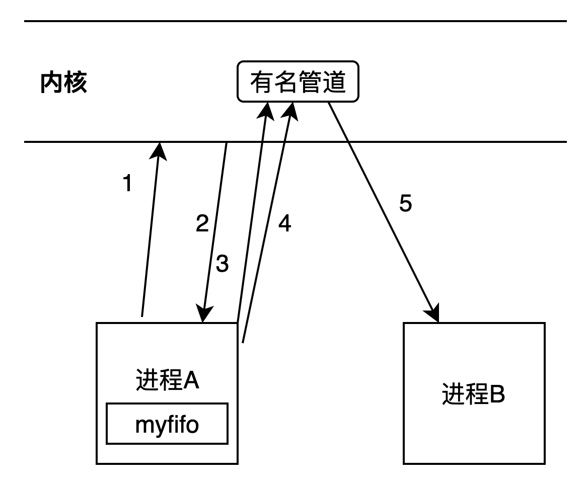

#2 管道通信
```
无名管道：文件系统中无文件名或者无文件节点
有名管道:文件系统中有文件名或文件节点
```

##2.1 无名管道
只能实现父子进程或者有亲缘关系的进程间通信。
* **通信原理**
```
step1: 父进程A创建无名管道，内核会创建内核对象，然后父进程fork，产生子进程B；
step2：父进程A向管道中写数据
step3：子进程B向管道中读数据
```

```
无名管道是一个特殊的文件，是由队列来实现的。
在文件io中创建或打开一个文件是由open来实现的，它不能用来创建或打开管道文件。
无名管道只能用pipe()函数来创建或打开。
```
无名管道是由队列来实现的，只能在队尾push（**写数据**到管道中），在队头pop（从管道中**读数据**）。

所以一个管道只能实现单向通信，**要实现双向通信，需要两个管道。**
###2.1.1 无名管道和普通文件io操作类比
* **创建或打开无名管道**  
  创建或打开无名管道文件：pipe()，pipe()类比open()。
  其余write、read、close均一致。
```
open函数：
    参数： 文件名、打开模式、权限
    返回值: 文件描述符

pipe函数
    无名管道，文件系统中无文件名，所以不需要文件名参数，也就不需要文件的权限，
    也不需要设置打开模式。
    
为什么pipe函数返回两个文件描述符？
    因为管道是单向队列，队头读数据，队尾写数据，写数据和读数据不在同一个位置，所以需要两个文件描述符。
    
函数形式: int pipe(int fd[2])
功能: 创建管道，为系统调用
头文件：unistd.h
参数：得到两个文件描述符，读描述符fd[0]，写描述符fd[1]
返回: 成功返回0，失败返回-1，失败时会设置errno(一般系统调用失败都会返回errno)
```
###2.1.2 无名管道文件读写的四种情况
假设io是阻塞的，没有设置O_NONBLOCK。
```
无名管道_单进程.cpp

// 情形1：关闭读，只写。直接异常，发送sigpipe信号
//closeread__write();

// 情形2：读不关闭，不读只写。写满后会阻塞，缓冲长度为65536字节。
//noread__write();

// 情形3：关闭写，只读。第一次读取出来的长度为0，就像读到了文件尾一样
//closewrite_read();

// 情形4：写不关闭，不写只读，此时读会阻塞
//nowrite_read();
```
查看进程状态 ps -axj
```shell
$ ps -axj | grep noname_pipe_oneprocess
 26560  26601  26600  26560 pts/0     26600 S+    1001   0:00 grep --color=auto noname_pipe_oneprocess
```
noname_pipe_oneprocess进程处于睡眠状态S+
###2.1.3 无名管道特点
```
管道只允许单向通信。
管道创建在内存中，进程结束，空间释放，管道就消失了。
管道内部保证同步机制，从而保证访问数据的一致性。
管道中的数据，读完就删除了（普通文件中的数据，读完后，数据还在）
面向字节流。
```
##2.2 有名管道
文件系统中存在文件节点，但不占磁盘空间
* **通信原理**
```
step1：进程A调用mkfifo；
step2：内核产生有名管道文件myfifo，返回给进程A。此时内核不会生成内核对象；
step3：进程A调用open函数打开myfifo文件，内核生成内核对象；
step4：进程A调用write函数，向内核管道对象中写入数据；
step5：进程B调用read函数，从内核管道中读取数据到用用户空间。
```

###2.2.1 有名管道文件和普通文件io操作类比
创建有名管道文件:mkfifo()，打开有名管道是open()。  
所以有名管道的mkfifo和open一起类比普通文件io的open操作。  
read、write、close和普通文件io的操作一致。

进程A通过mkfifo来创建有名管道文件时，内核向进程A的用户空间返回管道文件，**此时内核还没有创建内核对象**；  
然后进程A通过open来打开有名管道文件，此时内核会创建内核对象。
```
open函数：
    参数： 文件名、打开模式、权限
    返回值: 文件描述符
    

mkfifo函数
    创建有名管道，文件系统中有文件节点，所以需要文件名参数，也需要文件的权限，
    
函数形式: int mkfifo(const char *path, mode_t mode);
功能: 创建有名管道文件，为系统调用
头文件：unistd.h
参数：文件名路径和权限，权限受umask影响
返回: 成功返回0，失败返回-1，失败时会设置errno(一般系统调用失败都会返回errno)
```
* **不占磁盘空间的文件有哪些？**
```
只有文件节点inode，不占磁盘空间的有:
    管道文件
    字符文件
    块文件
    socket文件
既有文件节点inode，又占磁盘空间的有：
    普通文件
    目录文件
    符号链接文件
```