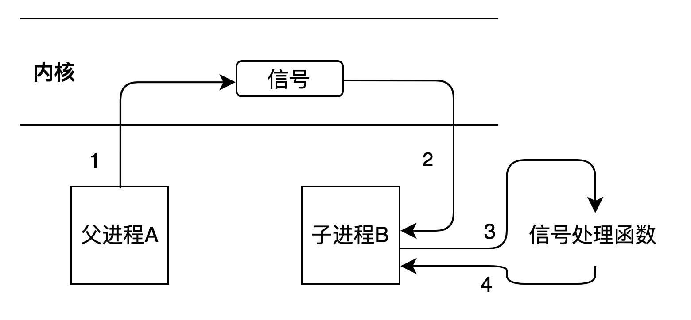

#3 信号通信 
信号位于内核中，内核中有很多信号。  
进程A向进程B发送某个信号，进程B接收该信号，实现进程间通信。
```
不同于管道，内核中的信号对象是已经存在的，不需要创建
```
内核可以发送多少种信号？
```shell
$ kill -l
 1) SIGHUP       2) SIGINT       3) SIGQUIT      4) SIGILL       5) SIGTRAP
 6) SIGABRT      7) SIGBUS       8) SIGFPE       9) SIGKILL     10) SIGUSR1
11) SIGSEGV     12) SIGUSR2     13) SIGPIPE     14) SIGALRM     15) SIGTERM
16) SIGSTKFLT   17) SIGCHLD     18) SIGCONT     19) SIGSTOP     20) SIGTSTP
21) SIGTTIN     22) SIGTTOU     23) SIGURG      24) SIGXCPU     25) SIGXFSZ
26) SIGVTALRM   27) SIGPROF     28) SIGWINCH    29) SIGIO       30) SIGPWR
31) SIGSYS      34) SIGRTMIN    35) SIGRTMIN+1  36) SIGRTMIN+2  37) SIGRTMIN+3
38) SIGRTMIN+4  39) SIGRTMIN+5  40) SIGRTMIN+6  41) SIGRTMIN+7  42) SIGRTMIN+8
43) SIGRTMIN+9  44) SIGRTMIN+10 45) SIGRTMIN+11 46) SIGRTMIN+12 47) SIGRTMIN+13
48) SIGRTMIN+14 49) SIGRTMIN+15 50) SIGRTMAX-14 51) SIGRTMAX-13 52) SIGRTMAX-12
53) SIGRTMAX-11 54) SIGRTMAX-10 55) SIGRTMAX-9  56) SIGRTMAX-8  57) SIGRTMAX-7
58) SIGRTMAX-6  59) SIGRTMAX-5  60) SIGRTMAX-4  61) SIGRTMAX-3  62) SIGRTMAX-2
63) SIGRTMAX-1  64) SIGRTMAX
```
##3.1 信号通信框架
###3.1.0 信号通信原理  
```
step1: 进程A告诉内核(进程A用户空间不能直接发信号)，发送信号sig给进程B;
step2: 内核发信号sig给进程B;
step3: 进程B暂停当前任务，转而执行信号处理函数;
step4: 信号处理结束后，回到之前的任务。
```

###3.1.1 信号的发送
```
kill：发信号给其他进程，可以发任意信号
raise：发信号给自己，可以发任意信号。
    等同于kill(getpid(), signum)
alarm：发信号给自己，只发一种信号（闹钟信号SIGALARM）
```
* **kill**  
发信号给其他进程，可以发任意信号
```c++
// 头文件
#include <sys/types.h>
#include <signal.h>

/*
 参数:
    pid: 发信号给进程pid
        pid > 0，发送信号给进程pid
        pid = 0，发送信号给当前进程组的每个进程
        pid = -1，暂时用不到
        pid < -1，发送信号给其他进程组(进程组id为pid绝对值)的每个进程
    sig: 发送信号类型
 返回值:
    成功返回0；失败返回-1，失败时会设置errno
*/
int kill(pid_t pid, int sig);
```
* **raise**  
发送信号给自己，可以发任意信号。  
目前没有发现raise()函数的应用场景，应为raise()可以用kill()代替。
```c++
// 头文件
#include <signal.h>

/*
 参数:
    sig: 发送信号类型
 返回值:
    成功返回0，失败返回非0
 * */
int raise(int sig);
```
* **alarm**  
发送信号给自己，只能发送SIGALRM信号。  
作为定时器使用，定时时间到了之后，会进入信号处理函数(SIGALRM信号的默认处理动作是退出进程)。
```c++
// 头文件
#include <unistd.h>

/*
 非阻塞函数，设置定时时间。
 参数: 
    seconds: 设置定时时间
        seconds = 0，取消之前的定时
        seconds > 0，设置定时时间
 返回值: 
    返回前一个定时的剩余时间。
*/
unsigned int alarm(unsigned int seconds);
```
```c++
alarm(10); // 设置定时时间为10s
alarm(20); // 在10s之内，再次调用alarm，取消之前的定时10s，重新设置定时20s
alarm(5); // 在20s之内，再次调用alarm，取消之前的定时20s，重新设置定时5s
```
###3.1.2 信号的接收
不让进程退出，才能接收到其他进程发过来的信号。
```
pause
sleep
while(1)
```
###3.1.3 信号的处理
```
signal
sigaction
```
三种信号处理方式
```
SIG_IGN : 忽略信号，好像收不到指定信号一样
SIG_DFL: 设置信号默认处理方式
自定义处理：信号发生后，会调用信号处理函数，信号处理结束后，继续之前的语句执行
```

##3.2 信号打断慢系统调用
慢系统调用基本上是阻塞式的系统调用，快系统调用基本上是非阻塞式的系统调用。  
**信号会打断阻塞的系统调用，不会打断非阻塞的系统调用。**
```
非阻塞式系统调用，有信号发生时，不会打断系统调用，待系统调用结束时再进入信号处理函数。

阻塞式系统调用，有信号发生时，会立即打断系统调用，转而执行信号处理函数。
当信号处理函数执行完毕后，是重新执行之前的系统调用函数呢？还是跳出系统调用函数，去执行下一条语句呢？
```
##3.3 signal和sigaction区别
```
signal:不能给信号处理函数传递用户数据，当系统调用被信号中断后，不能设置原系统调用是跳过还是重启。
sigaction: 可以给信号处理函数传递用户数据，还能附加信号的额外信息，当系统调用被中断后，还能设置原系统调用是跳过还是重启。
```
