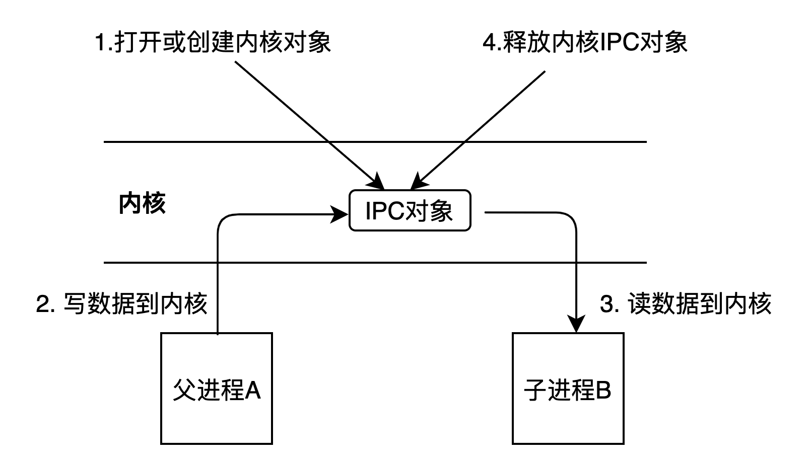
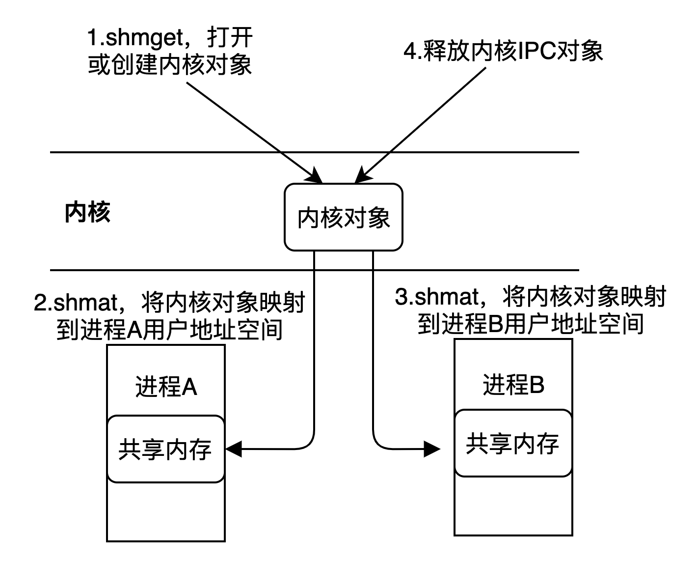

#4. 共享内存通信
```
共享内存的底层数据结构相当于c语言中的数组，数组的长度通过参数指定。
共享内存对象在内核中创建，然后在将内核中的共享内存映射到用户空间。
```

##4.1 IPC通信原理
```
step1: 打开或创建内核IPC对象
step2: 进程A向内核IPC对象写数据
step3: 进程B从内核IPC对象读数据
step4: 是否内核IPC对象
```

##4.2 IPC操作和文件IO操作类比
|   文件IO    |   IPC |
|   ---     |   --- |
|   open    |  shm_get<br>msg_get<br>sem_get|
|   write/read   |   msgsnd/msgrecv<br>shmat/shmdt<br>semop |
|   close   |   msgctl<br>shmctl<br>semctl   |
##4.3 共享内存通信原理
```
step1: 打开或创建内核共享内存对象
step2: 将内核对象映射到进程A的用户空间
step3: 将内核对象映射到进程B的用户空间
此时进程A和进程B在用户空间中指向同一片共享内存；
进程A对共享内存写数据，进程B能立即读取到；
之后，进程A和进程B释放内存映射；
step4: 释放内核共享内存对象。
```
* **共享内存和常规IPC通信区别**
```
常规IPC通信：
    在内核创建对象后，进程A将用户空间数据写入内核，会有一次数据拷贝，进程B从内核中读取数据到用户空间，又有一次数据拷贝，共需要2次数据拷贝。
共享内存：
    在内核创建对象后，将对象映射到进程A和B的用户空间，进程A写数据到共享内存，进程B能直接从共享内存读取出来，不需要切换到内核态。
    共享内存不需要时，需要先释放用户空间的映射地址，再释放内核对象。
```

##4.4 创建或打开共享内存shmget
```
open函数：
    参数： 文件名、打开模式、权限
    返回值: 文件描述符

int shmget(key_t key, size_t size, int shmflg);
    参数:
        key: 类似open函数的文件名
            IPC_PRIVATE，创建共享内存，只能父子或有亲缘关系进程间通信，类似无名管道
            ftok()函数的返回值作为key，能实现无亲缘关系进程间通信，类似有名管道。当key = ftok(...)时：
                shmflg = 0，打开已经存在的共享内存;
                shmflg = IPC_CREAT，共享内存存在，则打开，不存在，则创建；
                shmflg = IPC_CREAT | IPC_EXCL，共享内存不存在，则创建，存在，则失败；
                shmflg = IPC_CREAT | IPC_EXCL | 0666，设置共享内存的读写权限。
              
        size: 共享内存大小
        shmflg: 组合了open函数的打开模式+读写权限。
    返回值:
        成功:返回共享内存段标识符，可理解为文件描述符；失败返回-1，并设置errno。
```
* ftok  
  把路径名和项目id转换为system V的IPC key。
```
函数形式
    key_t ftok(const char *pathname, int proj_id);

参数:
    pathname:文件路径名，必须存在
    proj_id:项目id，随意给定一个

返回值:
    成功返回IPC key；失败返回-1

头文件
    #include <sys/types.h>
    #include <sys/ipc.h>
```
##4.5 共享内存的映射shmat（内核映射到用户空间）
shmat将内核的共享内存对象，映射到用户空间中的某个地址上。
```
头文件:
    #include <sys/types.h>
    #include <sys/shm.h>

函数形式:
void *shmat(int shmid, const void *shmaddr, int shmflg);

参数:
    shmid: 共享内存id
    shmaddr:映射到用户空间上的某个地址，设置为nullptr，由系统自己决定映射地址。
    shmflg: 设置共享内存的访问权限。
        SHM_RDONLY:只读
        0:  默认值，可读写

返回值:
    返回映射后的地址。
```
##4.6 释放共享内存的映射shmdt（内核映射到用户空间）
```
参数:
    shmaddr:对应用户空间的映射地址，是shmat函数的返回值
返回值:
    成功返回0，失败返回-1，并设置errno
int shmdt(const void *shmaddr);
```
##4.7 删除内核中的共享内存shmctl
shmctl函数用于控制共享内存，其中就包括删除共享内存。
```
头文件:
    #include <sys/ipc.h>
    #include <sys/shm.h>

参数:
    shmid:共享内存id
    cmd: 控制共享内存的方式
        IPC_STAT: 获取共享内存的信息，类似ipcs -m shmid
        IPC_SET: 设置或修改共享内存信息
        IPC_RMID: 删除共享内存，类似ipcrm -m shmid
    buf: 共享内存结构体指针，用于获取或修改共享内存信息，当删除共享内存时，buf可以设为nullptr

返回值:
    
int shmctl(int shmid, int cmd, struct shmid_ds *buf);
```
##4.8 父子进程通信-IPC_PRIVATE
要点：共享内存的创建必须在fork之前。fork不存在同步机制，这里用kill和pause组合的方式控制父子进程同步。
```c++
int main() {
    // 1.内核创建共享内存  shm_id = shmget()
    // 2.映射到父进程A用户空间    shmaddr = shmat()
    // 3.创建子进程B  fork。此时子进程B也已经完成映射，因为子进程B是父进程A的一个拷贝，拷贝了进程A的用户空间
    // 4.父进程A写数据到共享内存shmaddr，然后通知(kill方式)子进程B可以读，然后等待(pause方式)子进程读操作
    // 5.子进程B等待(pause方式)共享内存可读，然后读，然后通知(kill方式)父进程A已经读完。
    // 6.在父子进程中设置信号处理函数，用于处理信号事件。
}
```
##4.9 任意进程间通信
  采用kill和pause组合的方式来实现任意进程间通信。  
**但是kill函数如何提前知道对方进程的进程号呢？**  
约定同一主机上客户端进程和服务端进程采用共享内存方式通信。那么，需要注意如下事项：  
服务端进程需要先启动，然后将自己的进程号写入共享内存，因为服务端不知道客户端进程号，所以这里先不使用信号的方式，同时服务端将自己阻塞，直到客户端通知自己。
```c++
//服务端写数据
// 定义结构体，用于收发数据
struct st_shmbuf {
    pid_t pid;
    char buf[124];
};

int main() {
    // 1. 创建共享内存，共享内存的大小为sizeof(st_shmbuf)。 shm_id = shmget()
    // 2. 共享内存映射到用户空间st_shmbuf* shmaddr = shmat()

    //--------------交换进程号----------------------
    // 3. 把自己进程号写入共享内存 shmaddr->pid = getpid()
    // 4. 然后阻塞自己，直到客户端进程发送信号来唤醒自己，此时客户端也把自己的进程号发过来了，pause()
    // 5. 获取客户端进程号。 client_pid = shmaddr->pid;
    
    //--------------正常数据通信----------------------
    // 6. 然后开始正常写数据。写入shmaddr->buf
    // 7. 发送信号给客户端，通知客户端有数据可以读了。kill(client_pid, sigusr1)
    // 8. 阻塞自己，等待客户端通知自己
    
    // 9. 在函数入口处添加信号处理。
}
```
```c++
//客户端读数据
// 定义结构体，用于收发数据
struct st_shmbuf {
    pid_t pid;
    char buf[124];
};

int main() {
    // 1. 打开共享内存，共享内存的大小为sizeof(st_shmbuf)。 shm_id = shmget()
    // 2. 共享内存映射到用户空间st_shmbuf* shmaddr = shmat()

    //--------------交换进程号----------------------
    // 3. 获取服务端进程号，因为服务端先启动，所以共享内存中有服务端的进程号。 server_pid = shmaddr->pid;
    // 4. 把自己进程号写入共享内存 shmaddr->pid = getpid()
    // 5. 发送信号给服务端kill(server_pid, sigusr2)
    
    //--------------正常数据通信----------------------
    // 5. 阻塞自己，直到服务端进程发送信号来唤醒自己，此时共享内存已填充数据，pause()
    // 6. 然后开始正常读数据。从shmaddr->buf中读
    // 7. 发送信号给服务端，通知服务端可以继续写数据。kill(server_pid, sigusr2)
    
    // 8. 在函数入口处添加信号处理。
}
```
##4.10 无亲缘关系进程间双向通信
* **采用2个共享内存来实现**   
```
理由：参考聊天软件的思想，假定只有一个共享内存。
1. 如果用户A、B同时给对方发数据，最终只有一个数据是有效的，不是A改了B的数据，就是B改了A的数据。
2. A、B通信的方式不灵活，设计时通信协议就固定的。比如A给B发送数据后，等待B的读取，然后B给A发数据，然后A读取，然后给B发数据，如此往复。
 如果A想给B连续发送两条消息，B不想回复消息给A。那么是办不到的，因为设计时就约定了一来一回的通信方式。
```
* **服务端先启动，写进程号到shm，并pause阻塞自己**
```
理由：
1. 由于服务端和客户端无亲缘关系，服务端不知道客户端进程号，客户端不知道服务端进程号。
2. 服务端和客户端需要先互通进程号，才能实现双方互通消息。
3. 需要服务端先启动，并将服务端进程号写入共享内存，并pause阻塞自己。
4. 等待客户端启动，客户端读取共享内存，获取服务端进程号，并写入客户端进程号到共享内存中，并通过信号通知服务端。
```

* **进程死循环，不退出**
```
理由：
1. 为保证能一直进行读写，需要死循环的方式来实现。
```
* **正常数据通信，分为读线程和写线程**
```
服务端/客户端
    写线程：不需要阻塞，只需要写完数据，通过信号通知对方。
    读线程：先阻塞，直到可读。

探索读线程中的阻塞方式和唤醒方式。
    pause阻塞/signal唤醒。
        pause会阻塞线程，收到信号后，会立即中断当前执行语句，转而执行信号处理函数。但是当前执行语句是哪个地方呢？
        是子线程的pause()代码段？还是主线程的while(1)死循环？或是其他任意正在执行的代码段？猜测，中断是随机的。
        所以pause/signal方式具有不确定性。signal可能不会唤醒pause，而是中断其他代码断。
    condition阻塞/signal唤醒。
        条件变量适用于多线程，肯定是在读线程中condition.wait，在信号处理函数中condition.notify，可行吗？待尝试。
    sem/signal
        sem初始化为0，用于同步，在读线程中，set.wait()，在信号处理函数中，sem.post()，而信号由对端进程发射。
    sem
        信号灯完全可以用于控制进程间同步。
    mutex
        可以用于进程间互斥，但不能用于同步，不适用服务端和客户端通信的场景。
```
* **程序退出时资源的清理**
```
由于进程主线程、读子线程、写子线程都是死循环，程序无法正常退出，所以资源无法释放。

程序退出的方式：通过信号触发
  ctrl + c强制退出
  kill -9 强制退出

资源清理工作，在信号处理函数中进行
  共享内存资源的清理
```
   
